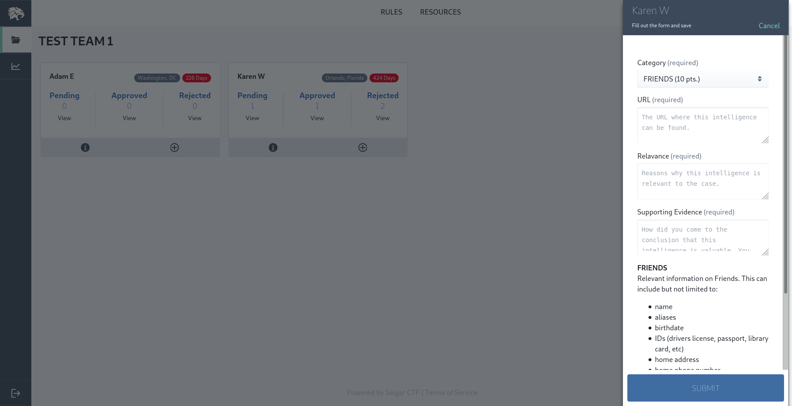
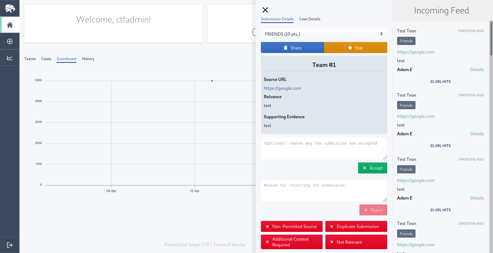
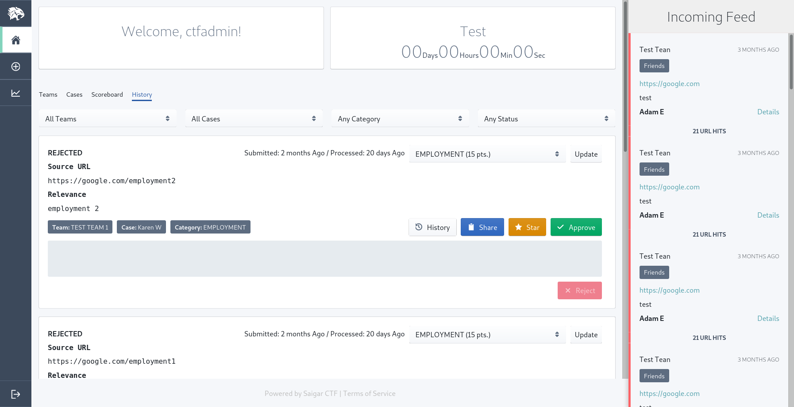
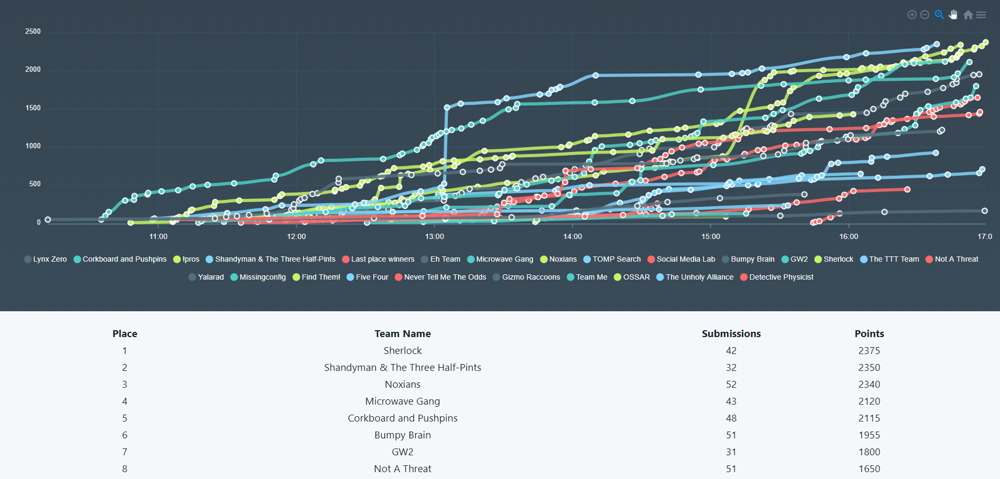

# Saigar CTF

### World's First CTF Platform for Crowdsourced Investigations

# Introduction

Saigar CTF is an open source CTF platform to facilitate crowdsourced investigations that can scale to hundred's of concurrent users with real time data. The largest event that the Saigar CTF platform has faciliated had **500+** users with over **8,000** submissions over a **6 hour** period.

See the introductory [blog post](https://medium.com/@peter_721/open-sourcing-the-saigar-ctf-platform-620c061f4d52) for more details.

# Features

- Role Based Access Control (Admin, Judges, Contestants)
- Eventbrite Integration
- Auth0 Integration
- Self registration for contestants
- Banning malicious users

- Realtime scoreboard
- Realtime feedback by Judges to Contestants on their submissions
- Realtime Submission Feed
- Ability to assign Teams to Judges
- Categorized Submissions
- Point system for Contestants
- History of all submissions for Judges to update
- Intuitive Submission Interface
- Exporting event data in CSV format to share with stakeholders

# Screenshots

# Architecture

| Topic               | Description           |
| ------------------- | --------------------- |
| Authentication      | Auth0                 |
| Frontend            | ReactJS               |
| GraphQL API         | Hasura                |
| Database            | Postgres              |
| File Storage        | MinIO                 |
| Supporting Services | Go                    |
| Deployment          | Docker/Docker Compose |
| Server OS           | Ubuntu                |

# Recommended Infrastructure Setup

Saigar CTF has successfully supported 500+ contestants on 2 \$20 Digital Ocean droplets:

- Backend droplet hosting the database, api, and file storage instance.
- Frontend droplet to host the UI web application

For smaller scale events, one droplet for the entire stack will suffice.

# Roadmap

- [ ] Create better documentation for deployment
- [ ] Automate the provisioning of infrastructure components
- [ ] Implement functionality to wipe data from within the UI
- [ ] Combine the individual services to one API
- [ ] Make seeding initial data easier
- [ ] Make integration between Auth0 and Saigar CTF easier
- [ ] Support multiple events in the platform

# License

Saigar CTF is Apache v2.0 License.

# :lock: Security

If you find a vulnerability in the Saigar CTF platform, don't hesitate to report it directly to [@SikulaPeter](https://twitter.com/SikulaPeter) by sending an email to sikula@protonmail.com. Please do not report vulnerabilities in GitHub issues

# :email: Contact

For any questions are inquires, don't hesitate to reach out (sikula@protonmail.com) or [@SikulaPeter](https://twitter.com/sikulapeter) on Twitter.
